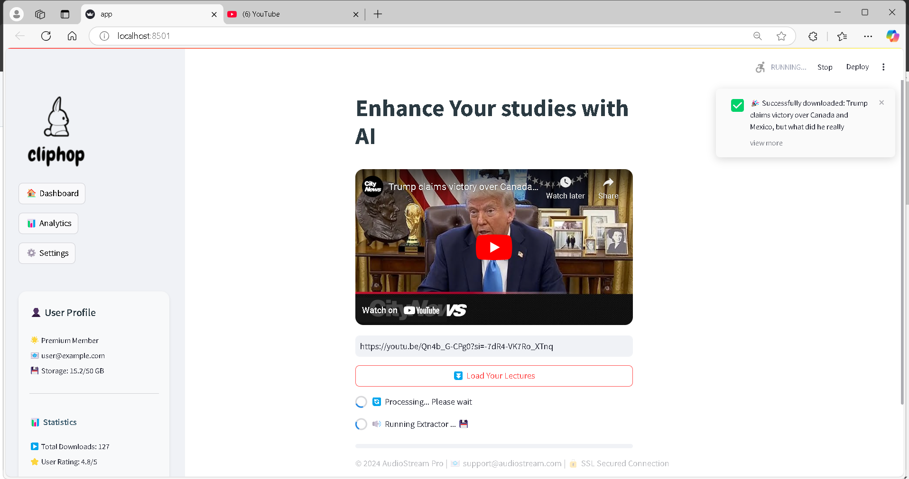

# VidChap Setup Guide

Prerequisites
Before you begin, make sure you have the following installed:
- [Git](https://git-scm.com/)
- [Node.js](https://nodejs.org/)

Setup Steps
First, clone the VidChap repository to your local machine:

```bash
git clone https://github.com/LCIT-AIP-W25/VidChap.git
```

# Node Setup (Java Script)

### 1. Navigate to the Project Directory
Change to the VidChap directory:

```bash
cd VidChap
```

### 2. Install Dependencies
Install the required dependencies for the project using npm:

```bash
npm install
```

### 3. Start the Backend Server
Once the installation is complete, start the backend server:

```bash
node backend/da.js
```

### 4. Open the Frontend
Finally, open the `frontend/index.js` file in your preferred code editor to start working on the frontend.

---

# streamlit setup (python)
```bash
cd vidchap
python -m pip install -r requirements.txt
streamlit run app.py
```

project_sc_1.mp4

![Watch the video]](https://github.com/LCIT-AIP-W25/VidChap/blob/testing/project_sc_1.mp4)

